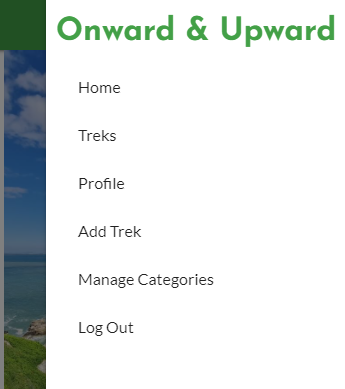

# Onward and Upward

Onward and Upward is a web app for trekking, hiking and sightseeing enthusiasts who want to discover new and exciting treks all over Ireland while also being able to add their own.

[View Live Website Here](https://onward-and-upward.herokuapp.com/)

# UX
## User Stories
---
### First Time user

As a user:

1. I want the design of the site to make a good impression on me.
2. I want to understand the purpose of the site.
3. I want to know how/why this site stands out from others in it's field.
4. I want to be able to easily navigate through the site.
5. I want to find treks that i have never seen before.

### Returning & Frequent User

1. I want to see what new content has been added to the site i.e new treks and hikes.
2. I want to follow the company on social media
3. I want to see which new features have been added to the site.
4. I want to be able to sign up for an email newsletter so i can recieve new recipes directly by email.
5. I want to be able to engage with the site owners to give feedback or request certain content.
6. I want to be able to add and edit my own treks on the site.

### Site Owner

As the site owner:

1. I want to be able to update the site regularly with new and exciting treks that users may not have seen before.
2. I want to be able to control all user conent, i.e editing and deleting users treks if necessary.
3. I want to be able to grow the Onward & Upward community, encouraging our users to update the site with their own treks.
4. I want to be able to engage with users through our social media platforms so we can keep track of feedback to make an improvements necessary.

___

# Design Choices

### Colour Scheme

My aim with the colour scheme of the site was for the aesthetic to reflect nature. I want to keep it simple, so as not to distract the user from the content. The green tones are associated with health, tranquility, power and nature. Greens are used to relax customers and promote environmental issues. 

The colour green stimulates harmony in your brain and encourages a balance leading to decisiveness.

I also added a dark-grey-blue colour for the text and headings to provide balance and reduce the harshness of the black text.

### Typography

The fonts i have used were chosen to both eye catching and funtional. I think the Josefin Sans font adds a stylish yet solid look to the site with Lato providing a much more functional look.

[Google Fonts](https://fonts.google.com/): PT Sans Narrow & Open Sans

## Wireframes 

Here are my original wireframe mockups.

I like to think i havent diverted too musch from my original idea for the site.

* Rather than a static hero image i opted for Materialize's Slider feature to add more dynamism to the Home page.

* I think i have stayed true to my orginal idea with the look being similar across all screen resolutions.

## Mobile First Design

* While building this site as the focus with Materialize is a mobile first approach i was conscious of my page looking responsive across a variety of media devices. This was something i was extremely vigilent with. 

* I found Materializes grid system to be very handy overrall with only some slight adjustments to be made with the below media query.

---
@media screen and (max-width: 480px) {
    .view-trek h2 {
        font-size: 30px;
        left: 20px;
    }

    .view-trek h4 {
        font-size: 25px;
        left: 20px;
    }

    nav .brand-logo {
        font-size: 25px;
        font-weight: 600;
    }

    .view-trek-headings {
        display: inline-block;
    }

--------

# Features

* Eye catching design with organised categories for admin to manage

* Sidenav for mobile

* Features Section

* CRUD Functionality for users and admin

## Future Scope

* Introduction of more user controls e.g allow user to edit their profile.

* Ratings and Comments feature for each trek.

* Integration of Google Maps API for trek locations.

* Create a tagging system for each trek which would link to treks with similar tags.

* 

# Technologies Used

## Languages Used

* [HTML](https://en.wikipedia.org/wiki/HTML5)
* [CSS](https://en.wikipedia.org/wiki/CSS)
* [Javascript](https://en.wikipedia.org/wiki/JavaScript)
* [Python](https://en.wikipedia.org/wiki/Python_(programming_language))

# Frameworks, Libraries, Programs and Sites.

* [Flask](https://materializecss.com/) - used as a framework in conjunction with Python

* [MongoDB](https://materializecss.com/) - used for the Database

* [Materialize](https://materializecss.com/) - used for Navbar, grid system and styling throughout the site.

* [Photoshop](https://www.adobe.com/ie/products/photoshop.html) - for image editing.

* [Balsamiq](https://balsamiq.com/) - for wireframes.

* [tinypng](https://tinypng.com/) - to reduce the size of the images used.

* [FontAwesome](https://fontawesome.com/) - for the icons used on the site.

* [Google Fonts](https://fonts.google.com/) - for the fonts used. 

* [GitHub](https://github.com/) - to host and publish the site.

* [Gitpod](https://gitpod.io/) - Used for version control by utilizing the Gitpod terminal to commit to Git and Push to GitHub.

* [Heroku](https://www.heroku.com/) - Used for deployment of web app.

# Testing

## Code Validation

I used W3 Schools code validators for the HTML and CSS, there are no errors in the HTML. 

There are errors in the CSS which can be attributed to the boostrap used on the site. There was one error in the CSS i had written.

`.social-links {
    text-align: "center";
}`

I have remedied this by removing the quotation marks around center, as follows:

`.social-links {
    text-align: center;
}`

[w3 HTML Validator Results](https://validator.w3.org/nu/?doc=https%3A%2F%2Fjeffgallagher86.github.io%2Fmilestone-project-1%2F)

[Jigsaw CSS Validator Results](https://jigsaw.w3.org/css-validator/validator?uri=https%3A%2F%2Fjeffgallagher86.github.io%2Fmilestone-project-1%2F&profile=css3svg&usermedium=all&warning=1&vextwarning=&lang=en#errors)

---

## Lighthouse and WAVE Web Accessibility Reports

* I am happy with the results of my lighthouse accessibilty reports for both Desktop and Mobile resapectively below, the only real issues i have come accross here are the colour contrast issues on the site, i weighed up the pros and cons of switching the colours, but i have decided to stick with my guns and not compromise on the aesthetic of the site.

* The only error in my WAVE report(aside from the contrast issues) was due to an ampty form label in my sign up section, i have sing removed this as i found it more visually pleasing and just as effective to use the placeholder text as an instruction for the Email Sign-up.

* I also conducted a Web Page Performance test. I was pleased with the results noting that website security is something i need to look into going forward.

# Deployment

## Publishing Project

This project was deployed to [GitHub](https://github.com/) pages as follows

1. Log-in to GitHub and open the repo for [MS1 The Veg Table](https://github.com/jeffgallagher86/milestone-project-1)
2. Locate and click on the Settings button at the top of the page.
3. Scroll down to the GitHub Pages section on the settings page.
4. Under "Source", click the dropdown called "None" and select "Master Branch".
5. The page will refresh.
6. Scroll down through the page to locate the now published site in the GitHub Pages section to retrieve the link.

## Cloning Project 

1. Log-in to GitHub and open the repo for [MS1 The Veg Table](https://github.com/jeffgallagher86/milestone-project-1)
2. Locate and click on the code section at the top of the page.
3. Click the code button as shown below to show copy of URL

4. Open Git bash terminal.
5. Change the current working directory to the location where you want the cloned directory.
6. Type in "git clone" followed by the copied URL and press enter key to create a local clone.

# Credits

## Media

* Recipe images used from [Jamie Olver's](https://www.jamieoliver.com/) site.

* Pumpkin and Squash Image by Tijana Drndarski taken from [Unsplashed](https://unsplash.com/photos/pZjTMVTGjlc).

* Squash Soup image by Cala taken from [Unsplashed](https://unsplash.com/photos/w6ftFbPCs9I).

* Smashed Avocado Image by Daria Shevtsova taken from [Pexels](https://unsplash.com/photos/w6ftFbPCs9I).

* Hero Image by R.F Studio taken from [Pexels](https://www.pexels.com/photo/photo-of-person-holding-fork-3621221/).

* All of these image where reduced in size using [Tinypng](https://tinypng.com/)

* [Multi-Device Mock Up](http://techsini.com/multi-mockup/index.php) image taken from technisi.

## Code

* Fonts used courtesy of [Google Fonts](https://fonts.google.com/).

* Bootstrap used for Navbar, grid system and styling throughout the site taken from [Bootstrap Docs](https://getbootstrap.com/).

* Icons used in site taken from [Font Awesome](https://fontawesome.com/).

* Some small snippets of code used from users on [Stack Overflow](https://stackoverflow.com/) and [YouTube]( https://www.youtube.com/watch?v=dJQedxalv64).

* Credit also goes to [w3Schools](http://w3schools.com/) for help along the way.

## Content 

* [Jamie Oliver's Roasted Blackbean Burgers](https://www.jamieoliver.com/recipes/vegetable-recipes/roasted-black-bean-burgers/) - Recipe & Image used

* [Jamie Oliver's Summer Tagliatelle](https://www.jamieoliver.com/recipes/pasta-recipes/summer-tagliatelle/) - Recipe & Image used

* [Jessica Chastaine's Tempura](https://www.jamieoliver.com/recipes/vegetable-recipes/jessica-chastain-s-tempura/) - Recipe & Image used

* [Waitrose's Squash and Feta Soup](https://www.waitrose.com/content/waitrose/en/home/recipes/recipe_directory/s/squash-and-feta-soup.html)

## Acknowledgements
* I would like to thank my mentor Akshat Garg for all his help with this project.

* I'd also like to thank all at Code Institute and the CI slack community for all their help along the way.

* Special mention for Anna Greaves for her README webinar also.

**Thank you very much for taking the time to review my work!**

